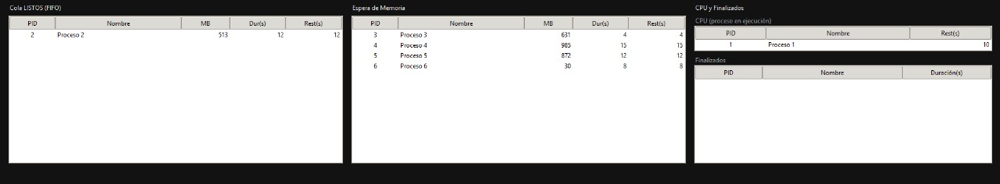
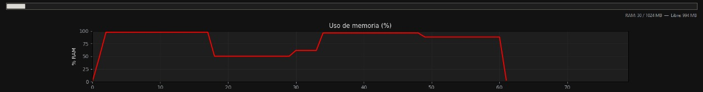

# Simulador de Gestión de Procesos en Memoria (FIFO • 1 CPU)

Este proyecto es una aplicación desarrollada en **Python** que simula la gestión de procesos en un sistema operativo con memoria RAM limitada.  
El objetivo principal es mostrar de forma visual e interactiva cómo los procesos entran en ejecución, esperan en cola por falta de memoria y liberan recursos al finalizar, todo bajo un planificador **FIFO** y con una única CPU.

---

## 1. Descripción del proyecto

El simulador permite:

- **Crear procesos** de forma manual o automática (aleatoria).
- **Gestionar memoria RAM** limitada (por defecto 1 GB) con asignación y liberación dinámica.
- **Ejecutar procesos** bajo un planificador FIFO, respetando el orden de llegada.
- **Mostrar el estado** de las colas de listos y de espera por memoria.
- **Visualizar en tiempo real** el uso de memoria mediante una barra de progreso y una gráfica de historial (% RAM usado).

La interfaz gráfica ha sido diseñada para ser minimalista y fácil de interpretar, permitiendo observar el comportamiento del sistema sin sobrecargar la vista con información innecesaria.

---

## 2. Tecnologías implementadas

- **Lenguaje de programación:**  
  Python 3.13

- **Bibliotecas / frameworks utilizados:**  
  - `tkinter` (interfaz gráfica nativa de Python).  
  - `matplotlib` (gráfica del uso de memoria en tiempo real).  
  - Librerías estándar de Python (`dataclasses`, `collections`, `enum`, etc.).

---

## 3. Instrucciones de instalación y uso

### Requisitos previos
- Tener instalado **Python 3.13** o superior.
- Tener instalado `pip` para la gestión de paquetes.

### Instalación de dependencias
1. Clonar este repositorio:
   ```bash
   git clone https://github.com/Asau31/SO_Proyect-1
   ```
2. Entrar en la carpeta del proyecto:
   ```bash
   cd "la ruta del proyecto"
   ```
3. (Opcional) Crear y activar un entorno virtual:
   ```bash
   py -m venv venv
   .\venv\Scripts\activate
   ```
4. Instalar las dependencias:
   ```bash
   pip install matplotlib
   ```

### Ejecución del programa
- **Opción 1**: Usar el entrypoint principal del simulador:
  ```bash
  py -m src.simumem
  ```
- **Opción 2**: Ejecutar el archivo lanzador:
  ```bash
  py -m src.simumem.run_gui
  ```

Al iniciar, se abrirá la ventana principal de la interfaz gráfica. (El comando puede cambiar, en lugar de py puede ser python3 depediendo de la version de python que tengas instalada)

---

## 4. Capturas de pantalla del programa en funcionamiento

### 4.1. Procesos en ejecución y en cola



### 4.2. Estado actual de la memoria RAM



---
